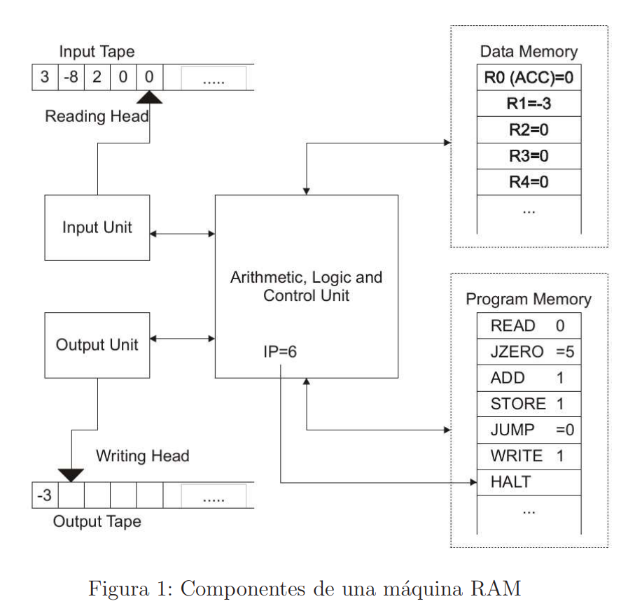
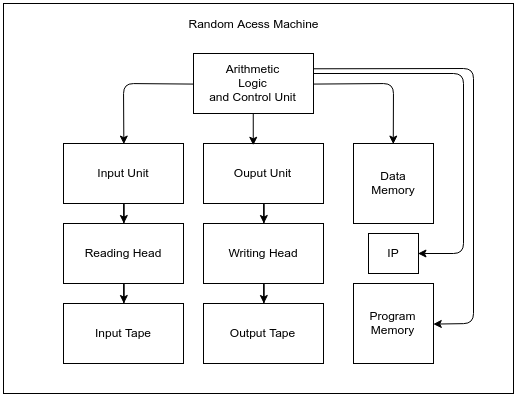

# Report

In this directory you can find a LaTeX template aimed to develop the report of your assignment.

# Diseño del Programa

## Overview

Nuestro objetivo es crear un simulador que emule el comportamiento de una **Random Access Machine** o en su forma abreviada **RAM**. Esta es una máquina abstracta perteneciente a las **register machines**, muy similar a la **counter machine** y **Turing-equivalente**.
Consta de un número infinito de registros y un número infinito de instrucciones ( condición que no llevaremos a la práctica pues nos es imposible reprensentar programas infinitos ), estas se cargan en la **memoria de programa** mientras que los registros se encuentran en una **memoria de datos**. A estas memorias accede una **Unidad Aritmética, Lógica y de Control** que se encarga de procesar las instrucciones y operar con los datos que se almacenan en los registros y los que se leen a partir de la **cinta de entrada** por medio de una cabeza lectora. El resultado de estas operaciones se almacena en la **cinta de salida** por medio de una cinta de escritura.

 Para empezar a diseñar el programa vamos a descomponer la máquina en una _jerarquía de dependencia_ a fin de establecer qué componentes son dependientes entre sí:

 Podemos ver que:

 +  La _cinta de entrada_ es directamente requerida por la _cabeza lectora_ de la máquina y ambas conforman la _unidad de entrada_.

 +  Ocurre lo mismo de manera análoga en el caso de la _unidad de salida_.

 +  A pesar de que la existencia de ambas memorias es indispensable para el funcionamiento de la máquina ninguna está contenida en la otra y no se comunican entre sí de forma directa sino por medio de la Unidad Aritmética, Lógica y de Control.

 + El registro IP a pesar de ser un registro no está contenido en la memoria de datos, se implementa de forma independiente.

 +  Por último ambas unidades, las dos memorias y el _registro apuntador de instrucción (IP)_ son requeridas por la Unidad Aritmético - Lógica y de Control y por lo tanto esta está conformada por todos ellos.

## Diseño del código

### Clases

#### ReadingHead

La clase ReadingHead se encarga de leer los datos de la **cinta de entrada** a partir de un fichero que se pasa por parámetro, por medio de un objeto de la clase **BufferedReader**.

#### WritingHead

La clase WritingHead se encarga de escribir los datos resultantes de la ejecución del programa en un **fichero de salida** que representa la **cinta de salida** por medio de un objeto de la clase **BufferedWriter**.

#### DataMemory

La clase DataMemory alberga los registros de la máquina como un **ArrayList de enteros**. A priori no podemos saber cuántos registros se van a necesitar, así que tenemos dos opciones:

1. Hacerle una pasada completa al programa para contar el número de registros diferentes que se requieren e inicializar posteriormente el ArrayList.
    + _Puntos a favor_ : Las inserciones son más eficientes porque sabemos el espacio de antemano y no tenemos que hacer un resize al vector cada vez que nos quedamos sin tamaño.
    + _Puntos en contra_ :  La complejidad intrínseca de tener que analizar las instrucciones una por una para saber qué tipo de operando se está tratando.  

2. Añadir registros a medida que se leen de la memoria de instrucciones.
    + _Puntos a favor_ : Es más sencillo de implementar que el método anterior y además en caso de que el programa fallase nos ahorraríamos tiempo.

En nuestro caso implementamos la segunda opción.

#### ProgramMemory

La clase ProgramMemory alberga los programas de la máquina como un **ArrayList de Strings**, la etiqueta de cada instrucción es representada como un indice.

#### Alcu

La clase Alcu representa la Unidad Aritmética, Lógica y de control. En esta están contenidas instancias de todas las clases anteriores y es la que se encarga de:

+   Leer y procesar las instrucciones de la memoria de programa.
+   Leer / escribir en la memoria de datos.
+   Leer de la cinta de entrada por medio de la ReadingHead.
+   Escribir en la cinta de salida a través de la WritingHead.

Además contiene un **entero** que realiza la función del **registro ip** almacenando el índice donde está almacenada en el ArrayList la instrucción a ejecutar.
